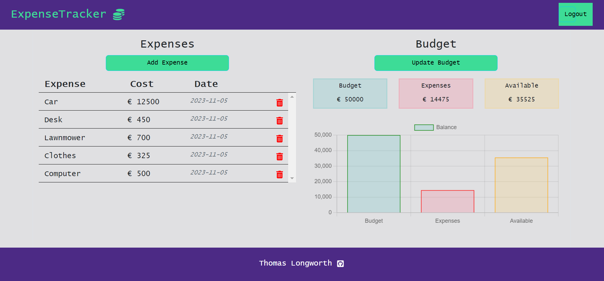

# ExpenseTracker - React & Node.js 

 

  

https://spend-wise-1-a80913de5bc1.herokuapp.com/

 
 

 

## Description

 

I created this [Expense Tracker](.herokuapp.com) to allow users to easily manage their expense. 

## Testing

## Error Handling

## Deployment

## Credits
